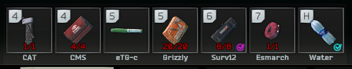
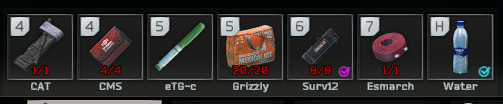

# QuickSlots

... Or something, I suck at naming stuff.

An SPTarkov client mod to better fit quick slot icons.

Vanilla:

Tweaked:

Logic is quite simple:

- Weapons and generally wide (horizontal) items are handled like vanilla, so tilted counter-clockwise
- "Square" and slightly tall items are kept upright, which lets them fill more of the quick slot, making them better visible
- Tall items (vertical, e.g. 1x3 cells) are rotated clockwise
- Stims are the only items with specialized handling as their default icon is misaligned with the rest

## Contributing:
Absolutely feel free to contribute!
For assembly references, copy referenced (or all) DLL assemblies from `SPT/BepInEx/core` and `SPT/EscapeFromTarkov_Data/Managed` into `./dependencies` and you should be good to build with .NET core!

Disclaimer: This was a very quick overnight idea done after my OCD got fed up with the default alignment, so this is a first world problem solution and probably won't be maintained for long